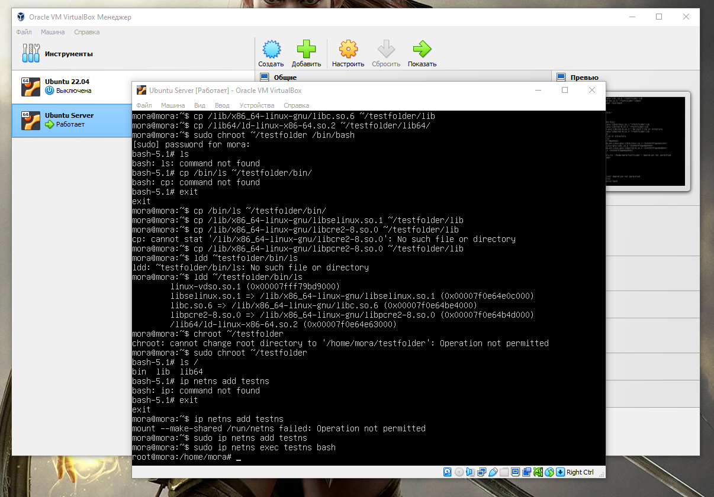

# Контейнеризация (семинары)


## Урок 1. Механизмы пространства имен
### **Информация о проекте**

Необходимо продемонстрировать изоляцию одного и того же приложения (как решено на семинаре - командного интерпретатора) в различных пространствах имен.

### **Изолированное выполнение процессов с помощью chroot и пространства имен в Linux**

- Подготовка к использованию chroot:

Для начала, создадим каталог "testfolder" в домашнем каталоге пользователя и скопируем необходимые исполняемые файлы и библиотеки в эту папку:
``` bash
mkdir ~/testfolder
mkdir ~/testfolder/bin
cp /bin/bash ~/testfolder/bin
mkdir ~/testfolder/lib ~/testfolder/lib64
cp /lib/x86_64-linux-gnu/libtinfo.so.6 ~/testfolder/lib
cp /lib/x86_64-linux-gnu/libc.so.6 ~/testfolder/lib
cp /lib64/ld-linux-x86-64.so.2 ~/testfolder/lib64/
```


- Запуск команды chroot, изменение корневой папки:

Запустим команду chroot для изменения корневой папки нашей текущей среды:
``` bash
sudo chroot ~/testfolder /bin/bash
```


Выполним команду ls:
``` bash
ls
В этот момент вы можете заметить ошибку:

bash: ls: command not found
```

- Добавление дополнительных файлов:

Для решения проблемы с отсутствием команды "ls" и других, продолжим копировать необходимые файлы:
``` bash
cp /bin/ls ~/testfolder/bin/
cp /lib/x86_64-linux-gnu/libselinux.so.1 ~/testfolder/lib/
cp /lib/x86_64-linux-gnu/libpcre2-8.so.0 ~/testfolder/lib/
```


- Подготовка для запуска:

Теперь мы можем выполнить следующие команды и убедиться, что все необходимые файлы скопированы и команда ls работает:
``` bash
ldd ~/testfolder/bin/ls
chroot ~/testfolder
ls /
```


### **Пример использования сетевого пространства имен:**

- Создание Пространства Имен для Сети:

Воспользуемся командой ip для создания сетевого пространства имен. Давайте создадим пространство имен с именем "testns":
``` bash
ip netns add testns
```

- Запуск Процесса в Пространстве Имен:

Используя команду ip, мы можем выполнить процесс в созданном пространстве имен:
``` bash
ip netns exec testns bash
```


Это подобно подключению процесса к изолированному свитчу, где процесс работает в собственной виртуальной сетевой среде.

- Изоляция и Проверка:

Внутри изолированной среды мы можем выполнить команды, такие как ip a, чтобы увидеть сетевые настройки. Однако, поскольку в этой среде нет реальных сетевых ресурсов, мы можем увидеть только виртуальные настройки.

Даже в этой изолированной среде, мы по-прежнему можем использовать команду ps aux, чтобы увидеть процессы, ограниченные только пространством имен.

 - Просмотр Процессов:

Выполнив команду ps aux, мы можем увидеть список всех процессов в текущем пространстве имен. Однако они будут ограничены только к процессам, которые работают в данной изолированной области.


## Более Глубокая Изоляция

Применяя дополнительные параметры, мы можем углубить уровень изоляции:

 - Изоляция по Процессам и Файловой Системе:

``` bash
unshare --net --pid --fork --mount-proc /bin/bash
ps aux
ip a
ps aux
ls
ls /
ps aux
```


*Подготовила студентка Geek Brains* [**`Эрина Ксения`**](https://github.com/MoraKsu)